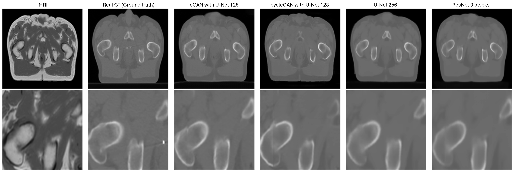
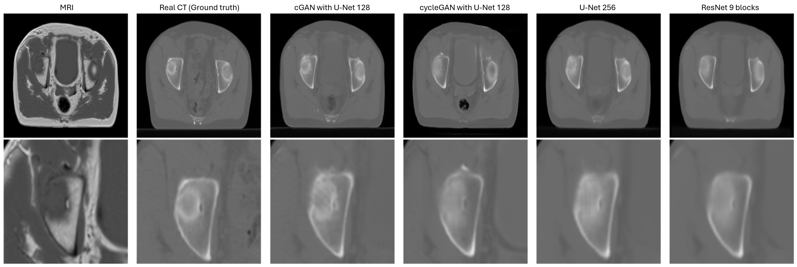
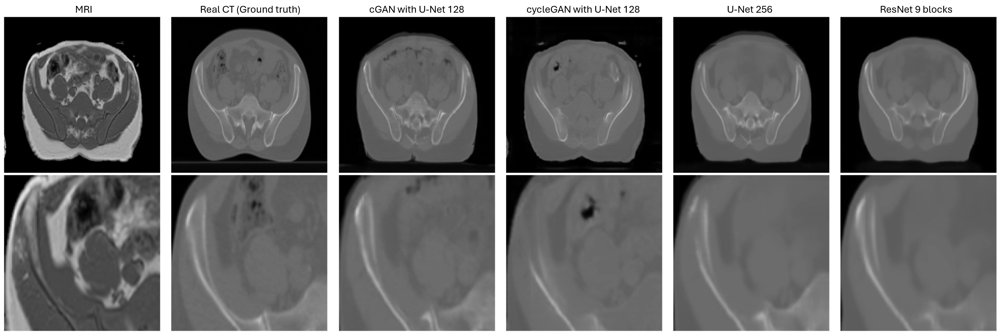

# MRI-to-CT

During my Master's, I worked on a deep learning project to generate a synthetic CT from an MRI of the pelvic region. The goal was to generate a synthetic CT that could be used for treatment planning in radiotherapy, eliminating the need to acquire a CT. This approach reduces workflow overload and image registration errors.

## Performance
The table below shows the performance of 4 different architectures on the test set. The test set contains 27 volumes (patients)
<table>
  <tr>
    <th colspan="2"> </th>
    <th> cGAN with U-Net 128 </th>
    <th>cycle GAN with U-Net 128 </th>
    <th>U-Net 256 </th>
    <th>ResNet 9 blocks </th>
  </tr>
  <tr>
    <td colspan="2"> SSIM </td>
    <td>0.822 ± 0.042</td>
    <td>0.762 ± 0.040</td>
    <td>0.839 ± 0.039</td>
    <td>0.833 ± 0.036</td>
  </tr>
  <tr>
    <td rowspan="4">MAE (HU)</td>
    <td> Bone </td>
    <td>161 ± 64</td>
    <td>259 ± 69</td>
    <td>156 ± 64</td>
    <td>168 ± 67</td>
  </tr>
  <tr>
    <td> Fat </td>
    <td>45.9 ± 25.2</td>
    <td>57.8 ± 34.0</td>
    <td>42.4 ± 24.4</td>
    <td>44.1 ± 29.0</td>
  </tr>
  <tr>
    <td> Soft tissue </td>
    <td>40.0 ± 12.1</td>
    <td>57.4 ± 23.2</td>
    <td>35.6 ± 11.8</td>
    <td>36.5 ± 12.8</td>
  </tr>
  <tr>
    <td> All tissues </td>
    <td>51.0 ± 16.1</td>
    <td>71.5 ± 21.5</td>
    <td>47.0 ± 15.6</td>
    <td>49.0 ± 18.5</td>
  </tr>
  <tr>
    <td>DSC</td>
    <td> Bone </td>
    <td>0.768 ± 0.082</td>
    <td>0.559 ± 0.111</td>
    <td>0.779 ± 0.082</td>
    <td>0.754 ± 0.093</td>
  </tr>
  <tr>
    <td colspan="2"> ME (HU) </td>
    <td>17 ± 15</td>
    <td>23 ± 21</td>
    <td>17 ± 14</td>
    <td>20 ± 17</td>
  </tr>
</table>

The U-Net 256 being the best performing model on these metrics.

## Example of synthetic CT
From left to right, we have the input MRI slice, the real CT (ground truth), the sCT generated by a conditional GAN (pix2pix) using a U-Net 128 generator, the sCT generated by a cycle GAN using a U-Net 128 generator, a simple U-Net 256, and a ResNet 9 blocks. These 4 different architectures are shown here. 

Here we have the output of the same architectures, but using another MRI slice.

Finally, one last slice.

## Code
The code is currently private

